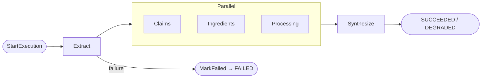
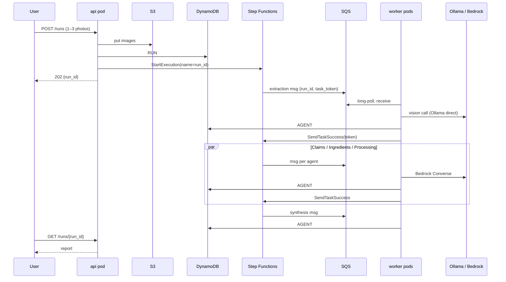

# FinePrint — Architecture

> Status: design locked 2026-09-23. Target build: weekend of 26–27 Sept 2026.
> Companion document: [requirements.md](requirements.md).

## 1. What this is (and isn't)

FinePrint takes 1–3 photos of **one** packaged food product and returns a hedged,
non-diagnostic report: are the front-of-package claims backed by the Nutrition Facts panel
and ingredient list, is sugar hiding under aliases, how processed is it, how does it fit a
personal profile, and an overall score.

The product is deliberately small. **The real purpose is learning how production agentic
pipelines are built on AWS**: orchestration, parallel fan-out/fan-in, schema-validated
LLM output, retries, idempotency, dead-letter queues, infrastructure as code and
Kubernetes. A single well-written prompt to a frontier model would give most of the
end-user value; that is explicitly not the point.

**Scope line (23 Sept):** one product, one run, a small app that deploys to Floci. No meal
logging, calorie/workout tracking, trends, multi-user support or web UI.

**Honest framing.** Everything runs against [Floci](https://floci.io/floci/), an
open-source local AWS emulator whose EKS is a real k3s cluster. This is real Kubernetes
and real Terraform against an emulator. It is not production AWS, and should never be
described as such. Strictly, the "agents" are LLM-powered workers inside a fixed
workflow, not autonomous agents: describe it as a *multi-agent pipeline orchestrated by
Step Functions*.

## 2. System overview

```
                        Your laptop (Windows + Docker Desktop)
 ┌─────────────────────────────────────────────────────────────────────────────┐
 │   you ──HTTP──►  kubectl port-forward                                       │
 │                        │                                                    │
 │  ┌─────────────────────▼─── EKS cluster (k3s container) ─────────────────┐  │
 │  │  namespace: fineprint                                                 │  │
 │  │   [api]      [extraction] [claims] [ingredients] [processing] [synth] │  │
 │  │     │             ▲           ▲          ▲             ▲         ▲    │  │
 │  └─────┼─────────────┼───────────┼──────────┼─────────────┼─────────┼────┘  │
 │        │             │ (poll)    │          │             │         │       │
 │  ┌─────▼─────────────┴───────────┴──────────┴─────────────┴─────────┴────┐  │
 │  │  Floci container  :4566                                               │  │
 │  │   S3 (photos)   DynamoDB (runs, outputs, profile)   SQS (5 queues+DLQ)│  │
 │  │   Step Functions (the workflow)   CloudWatch Logs   IAM   ECR   EKS   │  │
 │  │   Bedrock Runtime ──(proxy)──┐                                        │  │
 │  └──────────────────────────────┼────────────────────────────────────────┘  │
 │                                 ▼                                           │
 │   Ollama :11434 (qwen3.5) ◄─────┘   ◄── extraction pod calls it directly    │
 │                                         with images (see ADR-001)           │
 └─────────────────────────────────────────────────────────────────────────────┘
```

### Workflow



A failed analysis branch becomes a `{status: "degraded"}` marker, so Synthesis still runs
and the report says what is missing. A failed Extraction fails the run, because nothing
downstream can work without it.

### Lifecycle of one request



## 3. Technology primer

This section explains each piece from first principles, and how FinePrint uses it.

### 3.1 Bedrock Runtime and the `Converse` API

Amazon Bedrock is AWS's managed model service: you call an API and get a model
response, with no model servers to run. It offers two inference APIs:

- `InvokeModel` takes each model's *native* request body, so code is tied to a model family.
  Floci always stubs it. **Not used.**
- `Converse` takes **one message format for every model**. **This is what we use.**

```python
brt = boto3.client("bedrock-runtime", endpoint_url=FLOCI_URL, region_name="us-east-1")
resp = brt.converse(
    modelId="anthropic.claude-3-haiku-20240307-v1:0",   # Floci maps this to an Ollama model
    system=[{"text": "You classify food-label claims."}],
    messages=[{"role": "user", "content": [{"text": "Claims: ['High protein']"}]}],
    inferenceConfig={"maxTokens": 1024, "temperature": 0},
)
resp["output"]["message"]["content"]  # [{"text": ...}] or [{"toolUse": ...}]
resp["stopReason"]                    # "end_turn" | "tool_use" | "max_tokens" | ...
resp["usage"]                         # {"inputTokens": .., "outputTokens": ..}
```

A **message** is a turn with a `role` and a list of **content blocks** (`text`, `image`,
`toolUse`, `toolResult`). `stopReason == "max_tokens"` means the output was truncated and
must be treated as a failure.

**Structured output with tool use.** Define one tool whose input schema *is* the JSON
schema you want, and force the model to call it. The tool-call arguments are the
structured data; no real tool ever runs.

```python
tool = {"toolSpec": {
    "name": "record_claim_types",
    "description": "Record the type of each front-of-package claim.",
    "inputSchema": {"json": ClaimTypes.model_json_schema()},
}}
resp = brt.converse(..., toolConfig={"tools": [tool],
                                     "toolChoice": {"tool": {"name": "record_claim_types"}}})
block = next(b for b in resp["output"]["message"]["content"] if "toolUse" in b)
result = ClaimTypes.model_validate(block["toolUse"]["input"])  # always validate
```

**In Floci**, with `FLOCI_SERVICES_BEDROCK_RUNTIME_BACKEND=proxy`, `Converse` is
translated to an OpenAI-style `/v1/chat/completions` call to Ollama and the reply is
translated back. `FLOCI_SERVICES_BEDROCK_RUNTIME_PROXY_MODEL_MAPPING` maps a Bedrock model
id to an Ollama model name, so application code uses real Bedrock ids.

### 3.2 The `ModelClient` interface (ADR-001)

Agents never call a model provider directly. They call one interface, and configuration
picks the implementation:

```python
class ModelResult(BaseModel):
    data: dict
    model_id: str
    input_tokens: int
    output_tokens: int
    latency_ms: int

class ModelClient(Protocol):
    def structured(self, *, system: str, text: str, images: list[bytes],
                   schema: type[BaseModel], tool_name: str) -> ModelResult: ...
```

| Implementation          | Used by                                        | Mechanism |
|-------------------------|------------------------------------------------|-----------|
| `BedrockConverseClient` | claims, ingredients, processing, synthesis     | boto3 `converse` with forced tool use |
| `OpenAICompatClient`    | extraction (local only)                        | `POST {OLLAMA}/v1/chat/completions`, images as base64 data URIs |
| `FakeModelClient`       | all tests                                      | returns recorded JSON fixtures |

It also gives us one place for timeouts, retries, token accounting and latency metrics,
and it makes agents testable without a model.

### 3.3 Step Functions (orchestrator)

A managed workflow engine. The workflow is a **state machine** written in the **Amazon
States Language (ASL)**, a JSON format. Each run is an **execution**. AWS persists where
every execution is, passes data between steps, retries, enforces timeouts and keeps a full
visual history.

**Why orchestration instead of choreography.** In choreography, services react to each
other's events and nothing owns the whole flow. The fan-in ("wait until all three branches
are done") must be hand-built with counters and race handling, and "where is run X stuck?"
means searching logs. In orchestration, one component owns the flow, and parallelism,
joining, retries, timeouts and history come built in.

| State    | Purpose                                | Our use |
|----------|----------------------------------------|---------|
| Task     | one unit of work                       | each agent |
| Parallel | run branches at once, wait for all     | Claims / Ingredients / Processing |
| Pass     | pass data through or inject fixed data | the "degraded" marker |
| Fail / Succeed | terminal states                  | end of run |

**Integration patterns** describe how a Task talks to another service. *Request-response*
calls the service and moves on. *`.sync`* waits for a job AWS knows how to track.
***`.waitForTaskToken`*** sends a message containing a unique **task token** and **pauses
until someone calls `SendTaskSuccess` or `SendTaskFailure` with that token.** That is how
Step Functions drives workers it knows nothing about, such as our EKS pods.

**Error handling:**
- `Retry`: which errors to retry, how long to wait before the first retry (`IntervalSeconds`),
  how many attempts (`MaxAttempts`), how much the wait grows each time (`BackoffRate`).
- `Catch`: once retries are exhausted, go to a named state instead of failing.
- `TimeoutSeconds` is the longest a task may take. `HeartbeatSeconds` is the longest gap
  allowed between the worker's "still alive" signals, so a dead worker is noticed quickly.

**Data flow.** Every state takes JSON in and produces JSON out. `ResultPath` controls where a
task's result is placed (e.g. `"$.extraction"` attaches it under that key). State payloads are
capped at **256 KB**, so only pointers (`run_id`) travel through the workflow. This is the
**claim-check pattern**.

```json
"Extract": {
  "Type": "Task",
  "Resource": "arn:aws:states:::sqs:sendMessage.waitForTaskToken",
  "Parameters": {
    "QueueUrl": "${extraction_queue_url}",
    "MessageBody": { "run_id.$": "$.run_id", "task_token.$": "$$.Task.Token" }
  },
  "TimeoutSeconds": 300,
  "HeartbeatSeconds": 60,
  "Retry": [{ "ErrorEquals": ["ModelError", "States.Timeout"],
              "IntervalSeconds": 5, "MaxAttempts": 2, "BackoffRate": 2.0 }],
  "Catch": [{ "ErrorEquals": ["States.ALL"], "ResultPath": "$.error", "Next": "MarkFailed" }],
  "ResultPath": "$.extraction",
  "Next": "Analyze"
}
```

`$.run_id` reads from the state input. `$$.Task.Token` reads from the execution context. A
key ending in `.$` means its value is a path to look up, not a literal.
`${extraction_queue_url}` is filled in by Terraform's `templatefile`, not by ASL.

### 3.4 SQS and the worker pattern

A managed message queue. Consumers **receive**, process and **delete** messages.

- **Visibility timeout:** a received message is hidden, not removed. If it isn't deleted in
  time (e.g. the worker crashed), it reappears for another consumer.
- **At-least-once delivery:** a message can be processed twice, so every worker must be
  **idempotent**.
- **Long polling** (`WaitTimeSeconds=20`): a receive call waits for messages instead of
  returning empty immediately.
- **Dead-letter queue (DLQ):** after `maxReceiveCount` receives without a delete, the message
  moves to a separate queue, so a poison message can't loop forever.

```python
while not shutting_down:
    for msg in sqs.receive_message(QueueUrl=Q, WaitTimeSeconds=20,
                                   MaxNumberOfMessages=1).get("Messages", []):
        body = json.loads(msg["Body"])
        with heartbeat(body["task_token"], msg):   # SendTaskHeartbeat + extend visibility
            try:
                result = agent.handle(body["run_id"])   # idempotent
                sfn.send_task_success(taskToken=body["task_token"],
                                      output=result.model_dump_json())
            except ModelError as e:
                sfn.send_task_failure(taskToken=body["task_token"],
                                      error="ModelError", cause=str(e)[:256])
            except sfn.exceptions.TaskTimedOut:
                pass   # Step Functions already gave up on this token
        sqs.delete_message(QueueUrl=Q, ReceiptHandle=msg["ReceiptHandle"])
```

**Two retry layers, two jobs:**

| Layer                 | Handles |
|-----------------------|---------|
| SQS redelivery        | worker **crashed**; nothing reported back |
| Step Functions Retry  | worker **reported** failure, or went silent past heartbeat/timeout; each retry sends a new message with a new token |

### 3.5 DynamoDB

A managed key-value / document database. Each item has a **partition key (PK)** and an
optional **sort key (SK)**. Items sharing a PK are stored together and fetched with one
`Query`. The table is designed around **access patterns**, not normalisation (single-table
design):

| PK                 | SK                  | Contents |
|--------------------|---------------------|----------|
| `RUN#<id>`         | `META`              | status, profile_id, image keys, execution ARN, created_at |
| `RUN#<id>`         | `AGENT#<name>`      | output JSON, status, prompt_version, model_id, tokens, latency_ms, attempts |
| `PROFILE#<id>`     | `META`              | profile fields |
| `IDEMP#<key>`      | `META`              | run_id (TTL-expired) |

- "Everything about a run" is one `Query` on `PK = RUN#<id>`.
- **Conditional writes** (`ConditionExpression="attribute_not_exists(PK)"`) make duplicate
  deliveries harmless: the second write fails, and the worker returns the stored output.
- Agent outputs are a few KB, well under the 400 KB item limit, so they live in DynamoDB.
  Only photos go to S3.

### 3.6 S3

Object storage: **buckets** hold **objects** addressed by **key**. Photos are stored at
`s3://fineprint-uploads/runs/<run_id>/images/<n>.<ext>`.

### 3.7 Kubernetes on EKS, and ECR

EKS is AWS's managed Kubernetes. In Floci it is a real k3s cluster in a Docker container.
`aws eks update-kubeconfig` points `kubectl` at it.

| Object         | What it is | Our use |
|----------------|------------|---------|
| Namespace      | a folder for resources | `fineprint` |
| Deployment     | "keep N copies of this pod running"; restarts crashed pods, rolls out new versions | api (2 replicas) + 5 workers |
| Service        | stable DNS name and load balancing for a set of pods | api only (workers pull from SQS) |
| ConfigMap      | non-secret configuration as environment variables | endpoints, queue URLs, table, model ids |
| Secret         | sensitive configuration | AWS credentials (fallback) |
| ServiceAccount | a pod's identity, mappable to an IAM role | one per component |
| Probes         | liveness (restart if failing) / readiness (no traffic until ready) | `/healthz`, `/readyz` |
| Requests/limits| reserved / maximum CPU and memory | every pod |

**One image, five worker Deployments.** Shared code, a different command each
(`fineprint worker extraction`, …), so each can be scaled, restarted and permissioned
independently.

**ECR** is the container registry. `docker push` to Floci's ECR URL; Floci configures k3s so
pods pull that image without retagging.

**Pod credentials.** On real EKS, a ServiceAccount is linked to an IAM role (IRSA / Pod
Identity) and pods receive temporary credentials for that role: least privilege per agent.
Floci supports Pod Identity, but its webhook needs TLS. Fallback: a Secret holding Floci's
dummy credentials. IAM policies are written correctly in Terraform either way.

**Reaching the API.** Floci's EKS does not provision load balancers, so use
`kubectl port-forward svc/api 8080:80`.

### 3.8 Terraform

You declare the infrastructure you want in `.tf` files; Terraform works out what to create,
change or delete to make reality match.

- **Provider:** plugin that talks to an API (here, `aws`, pointed at Floci).
- **Resource:** one thing to create, e.g. `resource "aws_sqs_queue" "work" {...}`.
- **References build the dependency graph:** mentioning `aws_sqs_queue.dlq["claims"].arn`
  inside another resource makes Terraform create the DLQ first. You never specify order.
- **State** (`terraform.tfstate`): the record mapping config blocks to real resource ids.
  Lose it and Terraform forgets what it created. Production keeps it remotely (S3 + lock).
- **Variables / outputs:** inputs to the config, and values printed afterwards (queue URLs,
  cluster name) that feed Kubernetes.
- **`for_each`:** one block, many resources (all five queues).

`terraform init` (download providers) → `plan` (show the diff; always read it) → `apply`
(make it so) → `destroy` (remove everything).

```hcl
provider "aws" {
  region                      = "us-east-1"
  access_key                  = "test"
  secret_key                  = "test"
  skip_credentials_validation = true
  skip_requesting_account_id  = true
  skip_metadata_api_check     = true
  s3_use_path_style           = true
  endpoints {
    s3             = var.floci_url
    dynamodb       = var.floci_url
    sqs            = var.floci_url
    sfn            = var.floci_url
    iam            = var.floci_url
    sts            = var.floci_url
    eks            = var.floci_url
    ecr            = var.floci_url
    ec2            = var.floci_url
    cloudwatchlogs = var.floci_url
  }
}

locals { agents = ["extraction", "claims", "ingredients", "processing", "synthesis"] }

resource "aws_sqs_queue" "dlq" {
  for_each = toset(local.agents)
  name     = "fineprint-${each.key}-dlq"
}

resource "aws_sqs_queue" "work" {
  for_each                   = toset(local.agents)
  name                       = "fineprint-${each.key}"
  visibility_timeout_seconds = 360
  redrive_policy = jsonencode({
    deadLetterTargetArn = aws_sqs_queue.dlq[each.key].arn
    maxReceiveCount     = 3
  })
}
```

`aws_eks_cluster` requires a VPC and subnets, so Terraform also creates a small VPC in
Floci's emulated EC2.

### 3.9 CloudWatch Logs

A **log group** per component (`/fineprint/<component>`) holds **log streams** per pod. Real
EKS usually ships container output with Fluent Bit; Floci does not install add-ons, so the
app logs JSON to stdout (for `kubectl logs`) **and** sends it to CloudWatch directly with a
logging handler (`watchtower`). Every line carries `run_id`, so one filter shows a whole run
across every pod.

## 4. Components

### 4.1 api

FastAPI Deployment (2 replicas) behind a ClusterIP Service. Accepts uploads, writes S3 and
DynamoDB, starts the execution, serves run status and reports. It never waits for models:
model calls take tens of seconds, far longer than an HTTP request should stay open.

### 4.2 Agents

All agents follow the same shape: load inputs by `run_id` → deterministic pre-work →
model call through `ModelClient` → schema validation → deterministic post-work → idempotent
write → report to Step Functions.

| Agent       | Model use | Deterministic part | Output |
|-------------|-----------|--------------------|--------|
| Extraction  | vision, Ollama direct | schema validation; %DV vs grams consistency | claims[], nutrition panel, ordered ingredients[], "Contains" line, per-field confidence / `unreadable` |
| Claims      | Bedrock: classify each claim's type and nutrient | `fda_claims.yaml` decides the verdict | per claim: `supported` / `not_supported` / `not_a_regulated_term` / `insufficient_data`, with the regulation cited |
| Ingredients | Bedrock: only for items the alias list can't match | `sugar_aliases.yaml`, `categories.yaml`, position in list, allergen match | flags with evidence |
| Processing  | Bedrock: suggest NOVA group | `nova_markers.yaml` sets a minimum group | NOVA group, markers, "estimate" label |
| Synthesis   | Bedrock: narrative text only | score formula, profile checks, banned-phrase check | final report |

**Principle: the model classifies and writes; code decides.** Verdicts and scores come from
rule tables and formulas, which are testable and can't hallucinate.

### 4.3 Profile

Stored in DynamoDB, passed by `profile_id`, one seeded default. Every field is checked in
code:

```yaml
profile_id: default
allergens: [peanuts, milk]      # from the FDA's 9 major allergens
max_added_sugar_g: 6            # per serving
min_protein_g: 10               # per serving
max_sodium_mg: 480              # per serving
avoid_categories: [artificial_sweeteners, sugar_alcohols]
```

## 5. Local runtime environment

Checked on the development machine 2026-09-23:

| Resource | Value |
|----------|-------|
| CPU | AMD Ryzen 7 9800X3D (8C/16T) |
| RAM | 31.5 GB (Docker/WSL2 gets ~16.5 GB by default) |
| GPU | AMD Radeon RX 9070 XT, 15.9 GB VRAM, used by Ollama via ROCm (gfx1201) |
| Ollama | 0.34.2 |
| Model | `qwen3.5` 9.7B Q4_K_M (6.6 GB): completion, **vision**, **tools**, thinking |
| Floci | 2.1.0; to be run from the repo's `docker-compose.yml` on `:4566` |

One model serves every agent: the vision path (Ollama direct) and the text path (Bedrock
proxy → Ollama) both point at the derived model `fineprint-qwen3.5`.

**Context length.** Ollama reserves GPU memory (the KV cache) for a model's full context
length when it loads, used or not. The global setting on this machine is 262144, which makes
`qwen3.5` occupy 14 GB of the 16 GB VRAM. FinePrint requests stay under ~10k tokens, so the
repo creates its own derived model, `fineprint-qwen3.5`, with `num_ctx 16384` baked in: 6.0 GB,
100% on the GPU. The derived model shares the base model's weights, and `make down` deletes it,
so global Ollama settings are never changed (requirements IAC-8). This can't be done per
request, because Floci's proxy speaks the OpenAI-compatible API, which has no `num_ctx` field.

## 6. Floci-specific constraints

| Constraint | Source | Consequence |
|------------|--------|-------------|
| Bedrock proxy drops `image` content blocks; only `text`, `toolUse`, `toolResult` are translated | `BedrockOpenAiTranslator.java` | ADR-001 |
| `InvokeModel` is always stubbed | Floci docs | use `Converse` only |
| Stub backend never returns `toolUse` | Floci docs | tests use `FakeModelClient`, not the stub |
| Step Functions timeout clock starts at *schedule* time, not pickup | Floci docs | generous `TimeoutSeconds` |
| EKS add-ons are metadata only; no load balancers / ingress | Floci docs | log shipping from app; `port-forward` |
| Pod Identity webhook requires TLS | Floci docs | Secret-based credentials as fallback |

## 7. Architecture decisions

**ADR-001 — Extraction calls Ollama directly; everything else uses Bedrock `Converse`.**
Floci's Bedrock proxy silently drops image blocks, so vision through Floci is impossible.
All model access goes through `ModelClient`; the extraction agent uses
`OpenAICompatClient` locally and would switch to `BedrockConverseClient` on real AWS (where
`Converse` accepts images) with a config change. Rejected: OCR then text-only Bedrock
(weak on nutrition tables); patching Floci (good stretch goal, not this weekend).

**ADR-002 — Orchestration with Step Functions, not choreography.** Fan-in, retries,
timeouts and run history come built in; hand-building them with SQS/EventBridge would
consume the build time.

**ADR-003 — Workers on EKS driven by `sqs:sendMessage.waitForTaskToken`.** The pattern for
letting Step Functions drive long-running workers it can't invoke directly. Lambda was not
chosen because EKS depth is a learning goal.

**ADR-004 — Terraform for AWS resources, Kustomize YAML for Kubernetes objects.** A clean
boundary; Terraform outputs become the ConfigMap.

**ADR-005 — Deterministic verdicts and scoring.** The model classifies and writes prose;
rule tables and code produce verdicts and scores, so results are reproducible and testable.

**ADR-006 — Single-table DynamoDB, photos in S3, pointers in workflow state.** Keeps Step
Functions payloads under 256 KB and a run readable with one `Query`.

## 8. Repository layout (planned)

```
fine-print/
  src/fineprint/
    api/            FastAPI app
    workers/        runner loop (SQS, heartbeat, task tokens)
    agents/         extraction, claims, ingredients, processing, synthesis
    models/         ModelClient + bedrock / openai_compat / fake
    schemas/        Pydantic contracts
    rules/          fda_claims.yaml, sugar_aliases.yaml, nova_markers.yaml, categories.yaml
    prompts/        <agent>/v1.md
    storage/        DynamoDB and S3 helpers
  infra/terraform/  providers, network, storage, queues, iam, ecr, eks, stepfunctions, logs, outputs
  infra/statemachine/fineprint.asl.json
  deploy/k8s/       kustomization, namespace, serviceaccounts, deployments, service, configmap
  tests/            unit, contract, integration, eval, fixtures
  scripts/          preflight, render-configmap, seed-profile (called by the Makefile)
  docs/             architecture.md, requirements.md
  docker-compose.yml  Floci and its web console (both pinned), Bedrock proxy configuration
  Dockerfile, Makefile
```

## 9. Bringing it up

```
make up     # preflight → floci → model → terraform → image → kubernetes → seed → report
make api    # port-forward to localhost:8080 (foreground)
make down   # kubectl delete → terraform destroy → docker compose down
```

The one-time manual setup is installing the tools and starting Ollama. Everything else is
`make up`, including the repo's own model with its context length (IAC-8). Run `make` from
Git Bash: from PowerShell, `bash` resolves to WSL. See requirements IAC-3 to IAC-8.
